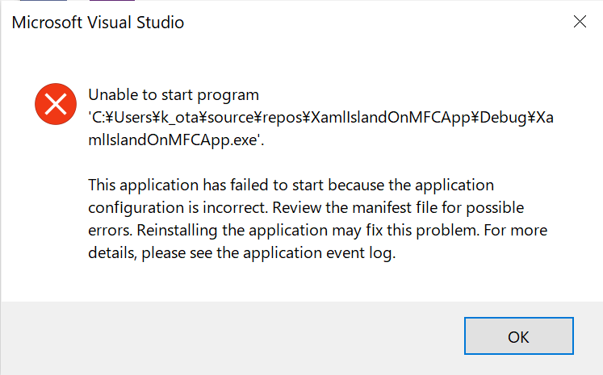

# How to add XAML Islands on a MFC app.

## Step 1: Create a new project

Create a new MFC app project. I used default options.

## Step 2: Add required packages to use XAML Islands.

Add two NuGet packages to the project.

- Microsfot.Windows.CppWinRT(latest stable version)
- Microsoft.Toolkit.Win32.UI.SDK(v6.0.0-preview7.1)

After added `Microsoft.Toolkit.Win32.UI.SDK` package, a below error would be occurred when trying to launch the app.



To fix the error, change DPI Awareness property to `Per Monitor High DPI Aware` from `High DPI Aware` at `Input and Output` page of `Manifest Tool` at the propject settings page.


## Step 3: Initialize XAML Islands

To initialize XAML Islands, please change couple files like below:

#### pch.h file

Add include statements under `#include "framework.h"` statement:

```cpp
#pragma    push_macro("TRY")
#undef TRY
#include <unknwn.h> // To enable support for non-WinRT interfaces, unknwn.h must be included before any C++/WinRT headers.
#include <winrt/Windows.Foundation.h>
#include <winrt/Windows.Foundation.Collections.h>
#include <winrt/Windows.UI.Xaml.Controls.h>
#include <winrt/Windows.UI.Xaml.Hosting.h>
#include <windows.ui.xaml.hosting.desktopwindowxamlsource.h>
#pragma pop_macro("TRY")
```

#### YourProjectName.h file

Add a filed to hold a WindowsXamlManager instance.

```cpp
class CXamlIslandOnMFCAppApp : public CWinAppEx
{
public:
	CXamlIslandOnMFCAppApp() noexcept;

private:
	// Add a this field
	winrt::Windows::UI::Xaml::Hosting::WindowsXamlManager windowsXamlManager = winrt::Windows::UI::Xaml::Hosting::WindowsXamlManager{ nullptr };

// Overrides
public:
	virtual BOOL InitInstance();
	virtual int ExitInstance();

// Implementation
	UINT  m_nAppLook;
	BOOL  m_bHiColorIcons;

	virtual void PreLoadState();
	virtual void LoadCustomState();
	virtual void SaveCustomState();

	afx_msg void OnAppAbout();
	DECLARE_MESSAGE_MAP()
};
```

#### YourProjectName.cpp file

Add couple statements to initialize XAML Islands, before creating `CMainFrame`  in `InitInstance` method.

```cpp
// Add following two statements
winrt::init_apartment(winrt::apartment_type::single_threaded);
windowsXamlManager = winrt::Windows::UI::Xaml::Hosting::WindowsXamlManager::InitializeForCurrentThread();

// create main MDI Frame window
CMainFrame* pMainFrame = new CMainFrame;
```

And add code to clean up the it to `ExitInstance` method.

```cpp
int CXamlIslandOnMFCAppApp::ExitInstance()
{
	//TODO: handle additional resources you may have added
	AfxOleTerm(FALSE);

    // close
	windowsXamlManager.Close();
	windowsXamlManager = winrt::Windows::UI::Xaml::Hosting::WindowsXamlManager{ nullptr };

	return CWinAppEx::ExitInstance();
}
```

## Step 4: Create an island

Create an island on a view class. You can create it to all views.
Create an island to `ProjectNameView` class are as fllows.

Add a filed to hold an instance of `DesktopWindowXamlSource` class.

```cpp
private:
	winrt::Windows::UI::Xaml::Hosting::DesktopWindowXamlSource desktopSource = winrt::Windows::UI::Xaml::Hosting::DesktopWindowXamlSource{ nullptr };
```

Add `OnCreate` method to handle `WM_CREATE` message using Class Wizard.


And also, add `OnClose` method to handle `WM_CLOSE` message.

Add code to create an isnald and put UWP controls to the island.

```cpp
int CXamlIslandOnMFCAppView::OnCreate(LPCREATESTRUCT lpCreateStruct)
{
	if (CView::OnCreate(lpCreateStruct) == -1)
		return -1;

	desktopSource = winrt::Windows::UI::Xaml::Hosting::DesktopWindowXamlSource{};
	auto interop = desktopSource.as<IDesktopWindowXamlSourceNative>();
	winrt::check_hresult(interop->AttachToWindow(this->GetSafeHwnd()));
	HWND xamlIslandHwnd;
	winrt::check_hresult(interop->get_WindowHandle(&xamlIslandHwnd));
	::SetWindowPos(xamlIslandHwnd, NULL, 10, 10, 510, 510, SWP_SHOWWINDOW); // resize island at x:10, y:10, width: 500(510 is cx), height:500(510 is cy).

	// Build UI using UWP controls.
	winrt::Windows::UI::Xaml::Controls::Grid root;
	winrt::Windows::UI::Xaml::Controls::TextBlock textBlock;
	textBlock.Text(L"Hello from XAML Island");
	textBlock.HorizontalAlignment(winrt::Windows::UI::Xaml::HorizontalAlignment::Center);
	textBlock.VerticalAlignment(winrt::Windows::UI::Xaml::VerticalAlignment::Center);
	root.Children().Append(textBlock);
	root.Measure(winrt::Windows::Foundation::Size{ 500, 500 });
	root.UpdateLayout();
	// set control to the island
	desktopSource.Content(root);
	return 0;
}

void CXamlIslandOnMFCAppView::OnClose()
{
	// Cleanup desktopSource
	desktopSource.Close();
	desktopSource = winrt::Windows::UI::Xaml::Hosting::DesktopWindowXamlSource{ nullptr };

	CView::OnClose();
}
```

## The result


